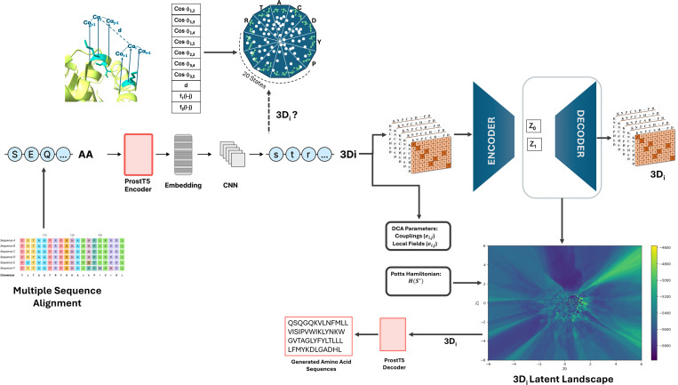

# DCA-3Di

Structure-aware protein landscape modeling with 3Di sequences, ProstT5 translation, variational autoencoders, and direct coupling analysis.

This repository is associated with the preprint:

Shukla D, Martin J, Morcos F, Potoyan DA. *A Structure-Aware Generative AI Framework for Revealing Functional Relationships in Proteins Families*. bioRxiv, 2025. DOI: [10.1101/2025.09.18.676787](https://doi.org/10.1101/2025.09.18.676787)

## Pipeline Figure



Figure source: Fig. 1 from the associated preprint, reproduced here for repository documentation. The published caption describes the pipeline as: MSAs are translated to 3Di tokens with ProstT5, encoded with a VAE into a 2D latent space, decoded on a grid, and scored with a DCA-derived Potts Hamiltonian to produce a structural landscape.

## Project Overview

The method in the paper builds structure-informed protein landscapes by combining:

1. Multiple sequence alignments (MSAs) for a protein family
2. ProstT5 translation from amino acid sequences to 3Di tokens
3. A VAE that embeds 3Di sequences into a 2D latent space
4. Decoding across a latent grid to generate maximum-likelihood 3Di sequences
5. Mean-field DCA on the same 3Di MSA to obtain couplings and local fields
6. Hamiltonian scoring of decoded sequences to define an energy landscape

According to the paper, this pipeline is used to analyze structural and functional relationships across diverse families including globins, TRPM channels, kinases, malate dehydrogenases, glycoproteins, and viral proteins.

## What This Repository Implements

The local codebase contains the VAE and DCA parts of that pipeline, plus batch-script placeholders for the ProstT5 translation step.

- [`run_vae.py`](/Users/divyanshushukla/Downloads/github_repositories/DCA-3Di/run_vae.py): trains the VAE on a FASTA alignment
- [`model/`](/Users/divyanshushukla/Downloads/github_repositories/DCA-3Di/model): VAE model definition, sampling layer, and FASTA one-hot encoding utilities
- [`dca/`](/Users/divyanshushukla/Downloads/github_repositories/DCA-3Di/dca): mean-field DCA implementation, Hamiltonian scoring, contact-map helpers, and analysis utilities
- [`Analysis.ipynb`](/Users/divyanshushukla/Downloads/github_repositories/DCA-3Di/Analysis.ipynb): notebook for generating and plotting structural landscapes from saved data
- [`translate.sh`](/Users/divyanshushukla/Downloads/github_repositories/DCA-3Di/translate.sh): SLURM wrapper for an external translation script
- [`train.sh`](/Users/divyanshushukla/Downloads/github_repositories/DCA-3Di/train.sh): SLURM wrapper for VAE training

Important: ProstT5 itself and the amino-acid-to-3Di / 3Di-to-amino-acid translation code are not included in this repository. [`translate.sh`](/Users/divyanshushukla/Downloads/github_repositories/DCA-3Di/translate.sh) is only a template that points to a placeholder `PATH_TO_TRANSLATE.PY`.

## Relation To The Paper

The paper describes the conceptual model in terms of the 20-state 3Di alphabet. The code in this repository uses a 23-channel input representation in [`model/generator.py`](/Users/divyanshushukla/Downloads/github_repositories/DCA-3Di/model/generator.py) so that FASTA parsing can handle additional symbols such as `U`, `O`, gaps, and ambiguous characters. In practice:

- the scientific workflow is the same as in the paper: 3Di MSA -> VAE latent space -> decoded grid -> DCA Hamiltonian landscape
- the local loader is slightly more permissive than the simplified 20-state description in the manuscript

That distinction matters if you want the README to reflect both the paper and the actual implementation.

## End-To-End Workflow

The workflow implied by the paper and partially implemented here is:

1. Collect or build a family MSA in amino acid space.
2. Translate the aligned sequences into 3Di tokens with ProstT5.
3. Save the translated 3Di alignment as FASTA.
4. Train the VAE on the 3Di FASTA alignment.
5. Sample latent coordinates on a 2D grid.
6. Decode a maximum-probability 3Di sequence at each grid point.
7. Fit a DCA Potts model on the same 3Di alignment.
8. Score each decoded sequence with the DCA Hamiltonian.
9. Visualize the resulting structural energy landscape and compare clustering, annotation, contacts, or generated sequences.

The paper further describes translating decoded 3Di sequences back to amino acid sequences with the ProstT5 decoder, then validating them with annotation tools and structure prediction. That downstream generation step is not fully implemented in this repository.

## Repository Layout

- [`model/model.py`](/Users/divyanshushukla/Downloads/github_repositories/DCA-3Di/model/model.py): VAE encoder/decoder and training step
- [`model/layers.py`](/Users/divyanshushukla/Downloads/github_repositories/DCA-3Di/model/layers.py): reparameterization layer
- [`model/generator.py`](/Users/divyanshushukla/Downloads/github_repositories/DCA-3Di/model/generator.py): FASTA loading and one-hot encoding
- [`dca/dca_class.py`](/Users/divyanshushukla/Downloads/github_repositories/DCA-3Di/dca/dca_class.py): main DCA interface
- [`dca/dca_functions.py`](/Users/divyanshushukla/Downloads/github_repositories/DCA-3Di/dca/dca_functions.py): mfDCA internals and Hamiltonian calculations
- [`dca/dca_analysis.py`](/Users/divyanshushukla/Downloads/github_repositories/DCA-3Di/dca/dca_analysis.py): mapping and plotting helpers for DI/contact analysis
- [`dca/helper_functions.py`](/Users/divyanshushukla/Downloads/github_repositories/DCA-3Di/dca/helper_functions.py): PFAM cleaning/filtering and contact-map utilities
- [`data/globin/`](/Users/divyanshushukla/Downloads/github_repositories/DCA-3Di/data/globin): example globin landscape data
- [`data/muticlass_protease/`](/Users/divyanshushukla/Downloads/github_repositories/DCA-3Di/data/muticlass_protease): example peptidase data

## VAE Model

The training script is [`run_vae.py`](/Users/divyanshushukla/Downloads/github_repositories/DCA-3Di/run_vae.py):

```bash
python run_vae.py <input_fasta> <output_model_path> <log_dir_prefix>
```

Example:

```bash
python run_vae.py data/globin/3Di.fasta outputs/globin.keras logs/
```

Key settings in the current implementation:

- latent dimension = `2`
- batch size = `16`
- epochs = `1000`
- hidden width = `3 * sequence_length`
- reconstruction loss + KL divergence

The VAE maps each flattened one-hot encoded sequence into a 2D latent space and reconstructs per-position token probabilities with a softmax decoder.

## DCA Utilities

The DCA entrypoint is the [`dca`](/Users/divyanshushukla/Downloads/github_repositories/DCA-3Di/dca/dca_class.py) class in [`dca/dca_class.py`](/Users/divyanshushukla/Downloads/github_repositories/DCA-3Di/dca/dca_class.py).

Minimal example:

```python
from dca.dca_class import dca

model = dca("data/globin/3Di.fasta", stype="protein")
model.mean_field()

print(model.couplings.shape)
print(model.DI[:5])

energies, headers = model.compute_Hamiltonian("data/globin/all_grid.fasta")
```

This supports:

- fitting mean-field DCA on an alignment
- extracting DI scores
- loading couplings or local fields
- scoring sequences with the Potts Hamiltonian

## Example Data And Notebook

The included data and notebook match the structural-landscape workflow described in the paper.

- [`data/globin/3Di.fasta`](/Users/divyanshushukla/Downloads/github_repositories/DCA-3Di/data/globin/3Di.fasta): example 3Di alignment
- [`data/globin/all_grid.fasta`](/Users/divyanshushukla/Downloads/github_repositories/DCA-3Di/data/globin/all_grid.fasta): decoded or grid-sampled sequences used for landscape scoring
- [`data/globin/coord.pkl`](/Users/divyanshushukla/Downloads/github_repositories/DCA-3Di/data/globin/coord.pkl): latent coordinate metadata
- [`data/globin/entropy_map.npy`](/Users/divyanshushukla/Downloads/github_repositories/DCA-3Di/data/globin/entropy_map.npy): precomputed decoder entropy map
- [`Analysis.ipynb`](/Users/divyanshushukla/Downloads/github_repositories/DCA-3Di/Analysis.ipynb): notebook for computing Hamiltonians on a grid and visualizing the landscape

## Requirements

There is no lockfile or environment file in the repository. Based on imports, you will need at least:

- Python 3
- TensorFlow / Keras
- NumPy
- Biopython
- SciPy
- Numba
- Matplotlib
- Jupyter

Minimal install:

```bash
pip install tensorflow numpy biopython scipy numba matplotlib notebook
```

If you want to reproduce the full paper workflow, you will also need access to ProstT5 and any downstream tools used for generation and validation.

## Batch Scripts

[`train.sh`](/Users/divyanshushukla/Downloads/github_repositories/DCA-3Di/train.sh) and [`translate.sh`](/Users/divyanshushukla/Downloads/github_repositories/DCA-3Di/translate.sh) are cluster-oriented templates, not turnkey launch scripts.

- paths are placeholders
- `train.sh` points to a different repository directory name
- `translate.sh` expects an external translation script

## Current Limitations

- ProstT5 translation is external to this repository.
- Back-translation from decoded 3Di tokens to amino acid sequences is not implemented here.
- No pinned software environment is provided.
- The VAE latent dimension is hard-coded to 2 in the main training script.
- The codebase captures the core landscape-generation logic from the paper, but not every evaluation step described in the manuscript.

## Citation

If you use this repository, cite the preprint:

```text
Shukla D, Martin J, Morcos F, Potoyan DA.
A Structure-Aware Generative AI Framework for Revealing Functional Relationships in Proteins Families.
bioRxiv (2025).
doi:10.1101/2025.09.18.676787
```
